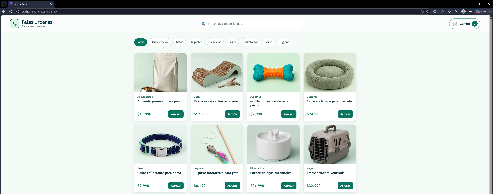
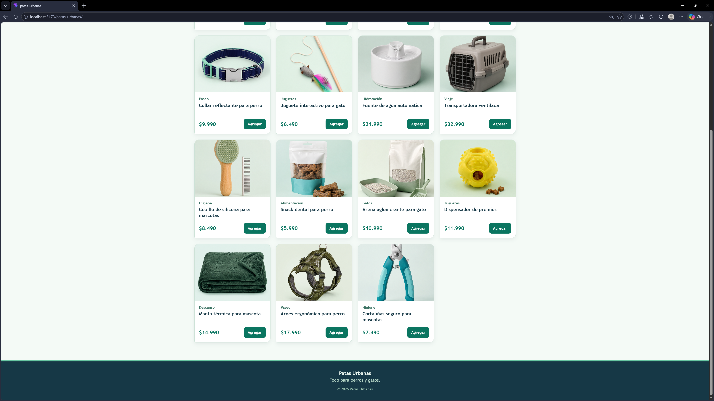
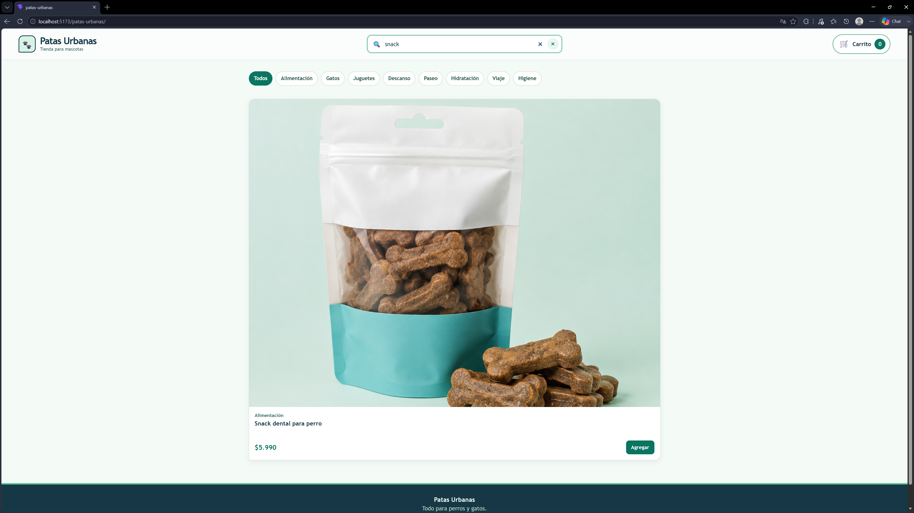

# Patas Urbanas

Patas Urbanas es un e-commerce ficticio de productos para mascotas. La aplicación permite explorar un catálogo de artículos para perros y gatos, filtrar por categoría o búsqueda, y agregar productos a un carrito con contador visible.

## Funcionalidades

- Catálogo local de 15 productos.
- Búsqueda de productos por nombre o categoría.
- Filtros por categorías mediante tabs.
- Botón para agregar productos al carrito.
- Contador de productos agregados en el Header.
- Diseño adaptable para pantallas pequeñas.

## Componentes creados

| Componente | Función |
| --- | --- |
| `Header` | Muestra el logo, el nombre de la tienda, el buscador y el contador del carrito. |
| `SearchBar` | Input controlado para buscar productos. |
| `CategoryTabs` | Tabs para filtrar productos por categoría. |
| `ProductCard` | Muestra imagen, categoría, nombre, precio y acción de cada producto. Recibe el producto mediante props. |
| `ProductList` | Renderiza las tarjetas con `map` y usa `key={product.id}`. |
| `Button` | Botón reutilizable con variantes `primary` y `secondary`. |
| `Footer` | Incluye información básica y derechos de la tienda. |

## Requisitos de la tarea cubiertos

- Componentes separados dentro de `src/components`.
- Datos simulados en `src/data/products.ts`.
- Cada producto contiene `id`, `name`, `price`, `category` e `image`.
- `ProductCard` recibe props tipadas.
- Uso de `useState` para el carrito, el texto de búsqueda y la categoría seleccionada.
- Listado de productos renderizado mediante `map` con claves únicas.

## Tecnologías utilizadas

- React
- TypeScript
- Vite
- CSS
- ESLint

## Instalación y ejecución

1. Clona el repositorio:

```bash
git clone https://github.com/SSAA96/patas-urbanas.git
```

2. Entra a la carpeta del proyecto:

```bash
cd patas-urbanas
```

3. Instala las dependencias:

```bash
npm install
```

4. Inicia el servidor de desarrollo:

```bash
npm run dev
```

5. Abre la dirección que indique la terminal, normalmente `http://localhost:5173`.

## Estructura principal

```text
src/
├── assets/products/    # Imágenes locales de los productos
├── components/         # Componentes reutilizables
├── data/products.ts    # Datos simulados del catálogo
├── App.tsx             # Estado e integración de la aplicación
└── index.css           # Estilos globales
```

## Capturas de pantalla

### Vista de Header, SearchBar y ProductCard



### Vista de Footer y ProductCard



### Vista de producto encontrado


